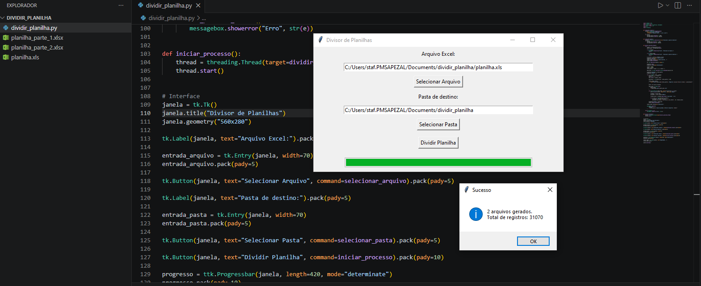

# 📊 Divisor de Planilhas

Ferramenta simples com interface gráfica para dividir planilhas Excel grandes em múltiplos arquivos menores (até 20.000 registros por arquivo), mantendo todos os dados como texto.

## ⬇️ Download

<p align="center">
  <a href="https://github.com/lailanga/divisor-planilhas/releases/tag/v1.0.0">
    
  </a>
</p>

## 🚀 Funcionalidades

* Interface gráfica (Tkinter)
* Seleção de arquivo e pasta de destino
* Divisão automática em blocos de 20.000 registros
* Preserva dados como texto (evita notação científica em CNPJ/CPF)
* Barra de progresso e status em tempo real

## 🛠️ Tecnologias

* Python
* Pandas
* Tkinter
* XlsxWriter

## ▶️ Como usar

1. Instale as dependências:

```bash
pip install -r requirements.txt
```

2. Execute:

```bash
python app.py
```

3. Selecione o arquivo e a pasta de destino
4. Clique em **Dividir Planilha**

## 📌 Observações

* Todos os dados são exportados como texto para evitar erros em importações
* Ideal para arquivos grandes que ultrapassam limites de sistemas

## 📷 Exemplo


